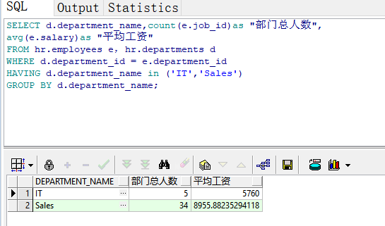

# 实验一：SQL语句的执行计划分析与优化指导
##实验目的
###分析SQL执行计划，执行SQL语句的优化指导。理解分析SQL语句的执行计划的重要作用。
##实验内容
####对Oracle12c中的HR人力资源管理系统中的表进行查询与分析。
####首先运行和分析教材中的样例：本训练任务目的是查询两个部门('IT'和'Sales')的部门总人数和平均工资，以###下两个查询的结果是一样的。但效率不相同。
####设计自己的查询语句，并作相应的分析，查询语句不能太简单。

##教材中的查询语句

#查询1：
    set autotrace on

    SELECT d.department_name,count(e.job_id)as "部门总人数",
    avg(e.salary)as "平均工资"
    from hr.departments d,hr.employees e
    where d.department_id = e.department_id
    and d.department_name in ('IT','Sales')
    GROUP BY d.department_name;
    
##执行效果

##分析：
  多表查询,查询hr用户中departments表，取别名为d.查询hr用户中employees表,其中限制条件为d中的department_id等于e中的department_id并且departments中的department_name为IT或Sales,并且通过group by,将所要查询的内容按照departments中的department_name的分组进行查询。查询的内容为:departments中的department_name,通过函数count计算job_id的个数，通过avg函数计算salary的平均值
    
    
    
#查询2：
set autotrace on

SELECT d.department_name,count(e.job_id)as "部门总人数",
avg(e.salary)as "平均工资"
FROM hr.departments d,hr.employees e
WHERE d.department_id = e.department_id
GROUP BY d.department_name
HAVING d.department_name in ('IT','Sales');
    
##执行效果

##分析：
  多表查询,查询hr用户中departments表，取别名为d.查询hr用户中employees表,其中限制条件为d中的department_id等于e中的department_id并且通过Having关键字限制departments中的department_name为IT或Sales,并且通过group by,将所要查询的内容按照departments中的department_name的分组进行查询。查询的内容为:departments中的department_name,通过函数count计算job_id的个数，通过avg函数计算salary的平均值.通过Having关键字，提高了程序执行的效率

#自定义查询
改动原因:由于只需要查询两个部门('IT'和'Sales')的部门总人数和平均工资，所以去掉查询d.department_name

SELECT d.department_name,count(e.job_id)as "部门总人数",
avg(e.salary)as "平均工资"
FROM hr.departments d,hr.employees e
WHERE d.department_id = e.department_id
GROUP BY d.department_name
HAVING d.department_name in ('IT','Sales');
    
##执行效果

##分析：
  多表查询,查询，取别名为d.查询hr用户中employees表,其中限制条件为d中的department_id等于e中的department_id并且通过Having关键字限制departments中的department_name为IT或Sales,并且通过group by,将所要查询的内容按照departments中的department_name的分组进行查询。查询的内容为:departments中的department_name,通过函数count计算job_id的个数，通过avg函数计算salary的平均值.通过Having关键字，提高了程序执行的效率